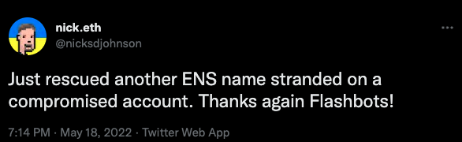

# Rescuing ENS names from compromised wallets (overview).



Inspired by nick.eth's twitter post [here](https://twitter.com/nicksdjohnson/status/1527065045678452736)

Often times when a wallet is compromised the attacker will leave some assets as a trap for the owner.

The trap works as follows: 
1) The attacker leaves some tokens in the compromised wallet but drains all the ether.
2) This means the owner can not transfer the tokens in the wallet until they send it more ether to cover the gas fee.
3) wait for the legitimate owner to try and save their precious tokens by sending eth to cover the gas fees of transferTo and and rob them again.

A "sweeper" loads a private key and attempts to send the full balance in a loop without much worry about processing power.
Enabling it to run indefinately for free or until cancelled/closed.

The problem being how does the hacked user send ether to the compromised account to fund the transaction of saving our tokens?

# Enter Flashbots bundles & sponsored transactions:
[https://github.com/flashbots/searcher-sponsored-tx](https://github.com/flashbots/searcher-sponsored-tx)

Sponsored transactions allow for one address to pay for the fees of another address's transaction by paying the miner directly using 
the solidity global block.coinbase. block.coinbase is a payable alias to the current block miners coinbase/payment address.

[https://docs.soliditylang.org/en/latest/units-and-global-variables.html](https://docs.soliditylang.org/en/latest/units-and-global-variables.html)

A simple contract below demonstrates fowarding payments to a miner:

```commandline
pragma solidity ^0.8.7;
contract MinerPayment {
    function payMiner() external payable {
        block.coinbase.transfer(msg.value);
    }
}
```


The flashbots team has deployed a simple contract which can be used for this here: [CheckAndSend Contract](https://etherscan.io/address/0xc4595e3966e0ce6e3c46854647611940a09448d3#code)

Next we need to understand a few EIP1559 specifics such as MaxFeePerGas, MaxPriorityFeePerGas and the blocks baseFee 
and how they are used to calculate the gas fee/cost of a transaction. This won't be covered.

For an overview of EIP1559 Gas description you can read [here](https://docs.alchemy.com/alchemy/guides/eip-1559/maxpriorityfeepergas-vs-maxfeepergas)

A note on transactions - an address must /always/ have the gas in its own balance to cover the block baseFee amount.

A sponsored transaction can only cover the MaxPriorityFeePerGas for another transaction and not the MaxFeePerGas.
[More info](https://docs.flashbots.net/flashbots-auction/searchers/advanced/eip1559)

How do we send the address ether to cover the gas fee for MaxFeePerGas without the attackers robbing it?

# Flashbots bundles

Flashbots works by sending bundles of transactions in a sort of private pool where people bid/pay miners directly.

A bundle is an array of transactions which will be executed consecutively in the same block/transaction. If any transaction
in the bundle shall fail the whole bundle will revert.

Users do not pay for failed transactions while using flashbots for submitting bundles.

[More info on FlashBots](https://docs.flashbots.net/flashbots-auction/overview)

The real magic that allows us to save tokens is the bundle functionality + sponsored transactions to be able to execute
the bundle from another wallet besides the compromised wallet. Not the fact that the transactions are "private".


# Plan of counter attack
This means, we can create a bundle of 3 transactions to accomplish this which will all be executed as if they were a single transaction in a single block.

Step 1 - send eth from another wallet to the compromised wallet to cover block baseFee.

Step 2 - transferTo the token from the compromised wallet to the rescuer wallet.

Step 3 - execute & pay for the transaction using sponsored transaction from the rescuer wallet via block.coinbase

# usage example
```commandline
ENSRescue.py --name hero --hacked-key AAAAAAAAAAAAAAAAAAAAAAAAAAAAAAAAAAAAAAAAAAAAAAAAAAAAAAAAAAAAAAAA --rescuer-key xxxxxxxxxxxxxxxxxxxxxxxxxxxxxxxxxxxxxxxxxxxxxxxxxxxxxxxxxxxxxxxx
[+] testnet enabled, connected to goerli infura node.
[+] rescuing names from: 0x59a02AA24367b293902002f1Df1F5D55e76B5b4C.
[+] sending rescued names to: 0x328eBc7bb2ca4Bf4216863042a960E3C64Ed4c10.
[+] Rescuing hero!
[+] token_id of hero.eth : 111124751542167998813960028570131154730449316884244675085439636823004772343202
[+] Bundle broad casted at block 6914883
...
[+] Bundle broad casted at block 6914888

[AttributeDict({'blockHash': HexBytes('0x342e7a0583e970df5c26bd5510331c681c01367921b182fcd1748674ecbf95e2'), 'blockNumber': 6914889, 'contractAddress': None, 'cumulativeGasUsed': 21000, 'effectiveGasPrice': 8, 'from': '0x328eBc7bb2ca4Bf4216863042a960E3C64Ed4c10', 'gasUsed': 21000, 'logs': [], 'logsBloom': HexBytes('0x00000000000000000000000000000000000000000000000000000000000000000000000000000000000000000000000000000000000000000000000000000000000000000000000000000000000000000000000000000000000000000000000000000000000000000000000000000000000000000000000000000000000000000000000000000000000000000000000000000000000000000000000000000000000000000000000000000000000000000000000000000000000000000000000000000000000000000000000000000000000000000000000000000000000000000000000000000000000000000000000000000000000000000000000000000000'), 'status': 1, 'to': '0x59a02AA24367b293902002f1Df1F5D55e76B5b4C', 'transactionHash': HexBytes('0x9845e7f18876f676b787af1a9bad1f2c8d587ef1d05691eeefedae71b4764ec8'), 'transactionIndex': 0, 'type': '0x2'}), AttributeDict({'blockHash': HexBytes('0x342e7a0583e970df5c26bd5510331c681c01367921b182fcd1748674ecbf95e2'), 'blockNumber': 6914889, 'contractAddress': None, 'cumulativeGasUsed': 62215, 'effectiveGasPrice': 8, 'from': '0x59a02AA24367b293902002f1Df1F5D55e76B5b4C', 'gasUsed': 41215, 'logs': [AttributeDict({'address': '0x57f1887a8BF19b14fC0dF6Fd9B2acc9Af147eA85', 'blockHash': HexBytes('0x342e7a0583e970df5c26bd5510331c681c01367921b182fcd1748674ecbf95e2'), 'blockNumber': 6914889, 'data': '0x', 'logIndex': 0, 'removed': False, 'topics': [HexBytes('0xddf252ad1be2c89b69c2b068fc378daa952ba7f163c4a11628f55a4df523b3ef'), HexBytes('0x00000000000000000000000059a02aa24367b293902002f1df1f5d55e76b5b4c'), HexBytes('0x000000000000000000000000328ebc7bb2ca4bf4216863042a960e3c64ed4c10'), HexBytes('0xf5ae61672361c474f5ea3e994da5ef9670fc4455792bd5cc81189dd6b2dc9da2')], 'transactionHash': HexBytes('0xb82841e22c1e6c7e1c443fc9d938b9e42b6318d7b505e47efc581cda4528d853'), 'transactionIndex': 1})], 'logsBloom': HexBytes('0x00000000000000000000000000000000000000000000000000000000100000000000000000000000000000000000000000000000000000000000000000000000000000000000000000000008000000000000000000000000000000000000000000000000000000000000000000000000000000000000000000000010100000000000000000000000000000000004000040000000000000000000000000000000000000000000000000004000000004000000000000000000000000000000000000400002000080000000000000000000000000000000000000080000820000000000000000000000000000000000000000000000000000000000000000002000'), 'status': 1, 'to': '0x57f1887a8BF19b14fC0dF6Fd9B2acc9Af147eA85', 'transactionHash': HexBytes('0xb82841e22c1e6c7e1c443fc9d938b9e42b6318d7b505e47efc581cda4528d853'), 'transactionIndex': 1, 'type': '0x2'}), AttributeDict({'blockHash': HexBytes('0x342e7a0583e970df5c26bd5510331c681c01367921b182fcd1748674ecbf95e2'), 'blockNumber': 6914889, 'contractAddress': None, 'cumulativeGasUsed': 93196, 'effectiveGasPrice': 8, 'from': '0x328eBc7bb2ca4Bf4216863042a960E3C64Ed4c10', 'gasUsed': 30981, 'logs': [], 'logsBloom': HexBytes('0x00000000000000000000000000000000000000000000000000000000000000000000000000000000000000000000000000000000000000000000000000000000000000000000000000000000000000000000000000000000000000000000000000000000000000000000000000000000000000000000000000000000000000000000000000000000000000000000000000000000000000000000000000000000000000000000000000000000000000000000000000000000000000000000000000000000000000000000000000000000000000000000000000000000000000000000000000000000000000000000000000000000000000000000000000000000'), 'status': 1, 'to': '0xFee1708400f01f2Bb8848Ef397C1a2F4C25c910B', 'transactionHash': HexBytes('0x5191f545478467cde77fad24a937a18e7778775402f5459b3cd0f2e6f6645136'), 'transactionIndex': 2, 'type': '0x2'})]

[+] Transaction confirmed at block 6914889 [flashbots]
```

# code

```python
#
# ENS Flashbots Rescue script (sponsored transaction)
# https://twitter.com/nicksdjohnson/status/1527065045678452736
#
# can be used to rescue a single name or provide a list of up to 29 names
# to rescue in a single transaction.

# lcfr.eth

from web3 import Web3, HTTPProvider
from eth_account import Account
from eth_account.signers.local import LocalAccount
from web3.middleware import construct_sign_and_send_raw_middleware
from web3.middleware import geth_poa_middleware
from flashbots import flashbot
from ast import literal_eval

import argparse, os, json, math

class ENSRescue:
    def __init__(self, args):
        self.nonce = None
        self.test_net = args.test_net

        self.target = args.target_name
        self.basefee_premium = 1.12 # 12% baseFee adjustment
        self.base_tip = args.base_tip
        self.last_sent_block = None
        self.rescuer_key = args.rescuer_key
        self.hacked_key = args.hacked_key
        self.names_file = args.names_file
        self.provider = os.getenv("NODE")
        self.rescuer_account = args.rescuer_account
        # Account with funds for the rescue operation

        self.ETH_ACCOUNT: LocalAccount = Account.from_key(self.rescuer_key)
        self.HACK_ACCOUNT: LocalAccount = Account.from_key(self.hacked_key)


        self.ENS_BASE_REGISTRAR = "0x57f1887a8bf19b14fc0df6fd9b2acc9af147ea85"

        if self.test_net:
            os.environ["FLASHBOTS_HTTP_PROVIDER_URI"] = "https://relay-goerli.flashbots.net"
            self.provider = f"https://goerli.infura.io/v3/yourkeyherelol" #goerli
            print("[+] testnet enabled, connected to goerli infura node.")
            self.chainID = 5

        if not self.provider:
            exit("[-] export provider URL in NODE env variable. Local or Infura or enable testnet mode.")

        self.w3 = Web3(HTTPProvider(self.provider))
        self.w3.eth.default_account = self.ETH_ACCOUNT.address

        if self.test_net:
            self.w3.middleware_onion.inject(geth_poa_middleware, layer=0)
            self.w3.middleware_onion.add(construct_sign_and_send_raw_middleware(self.ETH_ACCOUNT))

        self.br_abi_json = json.loads(open('./abi/' + self.ENS_BASE_REGISTRAR + '.json', 'r').read())

        self.ENS_REGISTRAR = self.w3.eth.contract(
            address=self.w3.toChecksumAddress(self.ENS_BASE_REGISTRAR),
            abi=self.br_abi_json
        )

        flashbot(self.w3, self.ETH_ACCOUNT)
        self.flashbots = self.w3.flashbots

    def derive_token_from_name(self, name):
        return literal_eval(Web3.keccak(text=name).hex())

    def transfer_from_call_data(self, from_acct, to_acct, token):
        call_data = self.ENS_REGISTRAR.encodeABI(fn_name="transferFrom", args=[from_acct, to_acct, token])
        return call_data

    def get_miner_calldata(self, price):
        miner_abi = json.loads(open('./abi/0xfee1708400f01f2bb8848ef397c1a2f4c25c910b.json', 'r').read())
        miner_contract = self.w3.eth.contract(
            address=self.w3.toChecksumAddress("0xfee1708400f01f2bb8848ef397c1a2f4c25c910b"),
            abi=miner_abi
        )
        call_data_miner = miner_contract.encodeABI(fn_name="payMiner", args=[self.w3.toWei(price, "gwei")])
        return call_data_miner

    def blank_tx(self):
        tx = {
            "signer": self.HACK_ACCOUNT,
             "transaction": {
                'chainId': self.chainID,
                'nonce': 0,
                "maxFeePerGas": 0,
                "maxPriorityFeePerGas": 0,
                'gas': 0,  
                'to': self.w3.toChecksumAddress(self.ENS_BASE_REGISTRAR), # change to ENS address
                "data": "",
                },
            }
        return tx

    def blank_miner_tx(self):
        miner_pay_tx = {
            "signer": self.ETH_ACCOUNT,
            "transaction": {
                'chainId': self.chainID,
                'nonce': 0,
                "maxFeePerGas": 0,
                "maxPriorityFeePerGas": 0,
                'to': self.w3.toChecksumAddress('0xfee1708400f01f2bb8848ef397c1a2f4c25c910b'),
            },
        }
        return miner_pay_tx


    def build_bundle(self, names):
        bundle_txs      = []
        rescue_tx_cnt   = 0
        hack_tx_cnt     = 0
        total_gas_cost  = 0
        estimate        = 0

        nonce_hack = self.w3.eth.getTransactionCount(self.HACK_ACCOUNT.address)
        nonce_rescue = self.w3.eth.getTransactionCount(self.ETH_ACCOUNT.address)

        if len(names) > 28:
            print(". Bundle can only hold 29 name transactions and found > 29 Names")
            return

        # loop names and do estimateGas() on transferFrom method to get the total gas cost we need to send the account.
        self.w3.eth.default_account = self.HACK_ACCOUNT.address
        for idx, name in enumerate(names):
            estimate = self.ENS_REGISTRAR.functions.transferFrom(self.HACK_ACCOUNT.address, self.ETH_ACCOUNT.address, name).estimateGas()
            base_fee = self.w3.eth.fee_history(1, 'latest')
            gas_total = estimate * math.floor(base_fee["baseFeePerGas"][1] * self.basefee_premium)
            total_gas_cost += gas_total

        base_fee = self.w3.eth.fee_history(1, 'latest')
        fund_tx = self.blank_miner_tx()

        fund_tx["signer"] = self.ETH_ACCOUNT
        fund_tx["transaction"]["nonce"] = nonce_rescue
        fund_tx["transaction"]["to"] = self.w3.toChecksumAddress(self.HACK_ACCOUNT.address)
        fund_tx["transaction"]["from"] = self.w3.toChecksumAddress(self.ETH_ACCOUNT.address)
        fund_tx["transaction"]["maxFeePerGas"] = math.floor(base_fee["baseFeePerGas"][1] * self.basefee_premium)
        fund_tx["transaction"]["gas"] = 21000
        fund_tx["transaction"]["value"] = total_gas_cost
        bundle_txs.append(fund_tx)
        rescue_tx_cnt += 1

        for idx, name in enumerate(names):
            base_fee = self.w3.eth.fee_history(1, 'latest')
            rescue_tx = self.blank_tx()
            rescue_tx["transaction"]["nonce"] = nonce_hack + hack_tx_cnt
            rescue_tx["transaction"]["gas"] = estimate
            rescue_tx["transaction"]["maxFeePerGas"] = math.floor(base_fee["baseFeePerGas"][1] * self.basefee_premium)
            rescue_tx["transaction"]["data"] = self.transfer_from_call_data(self.HACK_ACCOUNT.address, self.rescuer_account, name)
            bundle_txs.append(rescue_tx)
            hack_tx_cnt += 1

        miner_tx = self.blank_miner_tx()
        base_fee = self.w3.eth.fee_history(1, 'latest')
        miner_tx["transaction"]["maxFeePerGas"] = math.floor(base_fee["baseFeePerGas"][1] * self.basefee_premium)
        miner_tx["transaction"]["nonce"] = nonce_rescue + rescue_tx_cnt

        value = self.base_tip * len(names)  # self.base_tip 1.5 Gwei * Names = 1.5Gwei per name as tip.
        miner_tx["transaction"]["data"] = self.get_miner_calldata(value)
        miner_tx["transaction"]["value"] = self.w3.toWei(value, "gwei")

        bundle_txs.append(miner_tx)
        return bundle_txs

    def simulate_tx(self, bundle):
        result = self.flashbots.simulate(bundle, block_tag=self.w3.eth.block_number)
        if "error" in result["results"][0]:
            print(result["results"][0])
            exit(f"[-] {result['results'][0]['error']} - check tx and try again.")
        return

    def send_and_wait_flashbots(self, bundle):
        self.simulate_tx(bundle)
        block_number = self.w3.eth.blockNumber
        if self.last_sent_block == block_number:
            return False

        result = self.flashbots.send_bundle(bundle, target_block_number=block_number + 1)
        self.last_sent_block = block_number
        print(f"[+] Bundle broad casted at block {block_number}\n")
        try:
            result.wait()
            receipts = result.receipts()
            print(receipts)
            print(f"[+] Transaction confirmed at block {self.w3.eth.block_number} [flashbots]")
            return True
        except Exception as exception:
            return False

    def rescue(self, names):
        confirmed = None

        while not confirmed:
            rescue_bundle = self.build_bundle(names)
            confirmed = self.send_and_wait_flashbots(rescue_bundle)
        return

    def main(self):
        names = []
        print(f"[+] rescuing names from: {self.HACK_ACCOUNT.address}.")
        if not self.rescuer_account:
            self.rescuer_account = self.ETH_ACCOUNT.address

        print(f"[+] sending rescued names to: {self.rescuer_account}.")

        if self.names_file:
            name_list = open("./"+self.names_file, 'r').read()
            temp = name_list.split("\n")
            for name in temp:
                if name == "":
                    continue
                names.append(self.derive_token_from_name(name))

        if self.target:
            print(f"[+] Rescuing {self.target}!")
            token_id = self.derive_token_from_name(self.target)
            print(f"[+] token_id of {self.target}.eth : {token_id}")
            names.append(token_id)

        if len(names) > 0:
            #print("doing rescue lol")
            self.rescue(names)
        else:
            exit("[-] No names or file-path of names provided to rescue!")


if __name__ == '__main__':
    parser = argparse.ArgumentParser(description="ENSRescue - lcfr.eth (5/22)\n")

    parser.add_argument("--name", dest="target_name", type=str,
                        help="Target ENS name to purchase. or use --names-file for file/list of names.",
                        default=None)

    parser.add_argument("--hacked-key", dest="hacked_key",  type=str,
                        help="Private Key of the compromised wallet.",
                        default=False, required=True)

    parser.add_argument("--rescuer-key", dest="rescuer_key", type=str,
                        help="Private key of uncompromised wallet with funds to pay for the rescue.",
                        default=None, required=True)

    parser.add_argument("--rescue-account", dest="rescuer_account", type=str,
                        help="Address where to send rescued names. Does not need to be the address of --rescuer-key.",
                        default=None)

    parser.add_argument("--names-file", dest="names_file", type=str,
                        help="File path name of list of names to rescue.",
                        default=None)

    parser.add_argument("--basetip", dest="base_tip", type=float,
                        help="Base tip in GWEI - default is 1.5gwei, you can try to set this lower to save on total cost",
                        default=1.5)

    parser.add_argument("--testnet", dest="test_net", action='store_true',
                        help="Enable Testnet",
                        default=False)

    args = parser.parse_args()
    x = ENSRescue(args)
    x.main()
```
